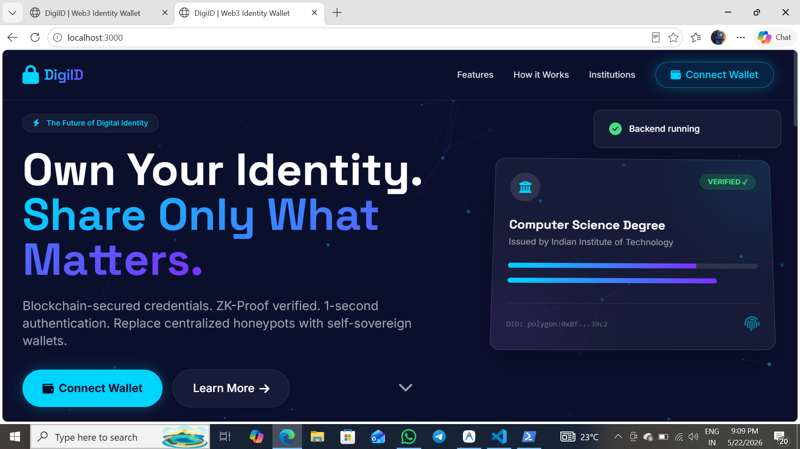
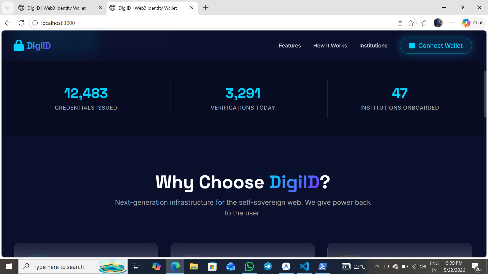
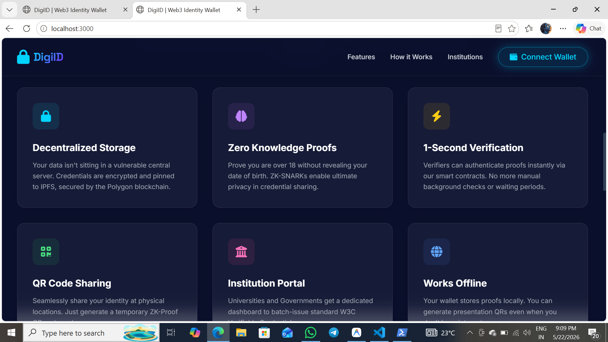
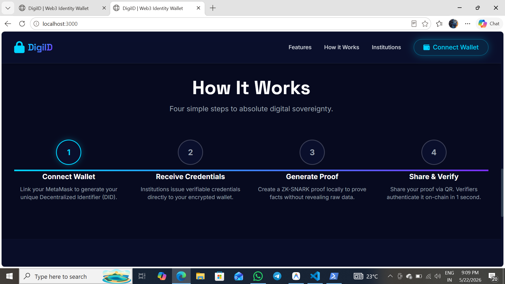
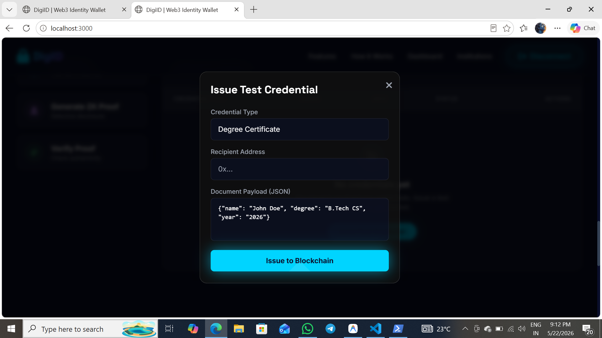
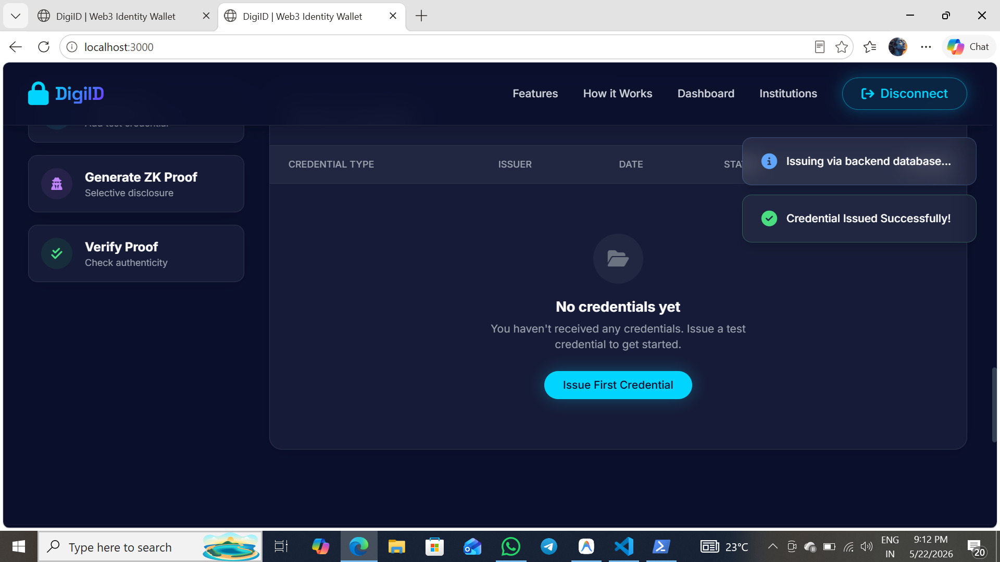
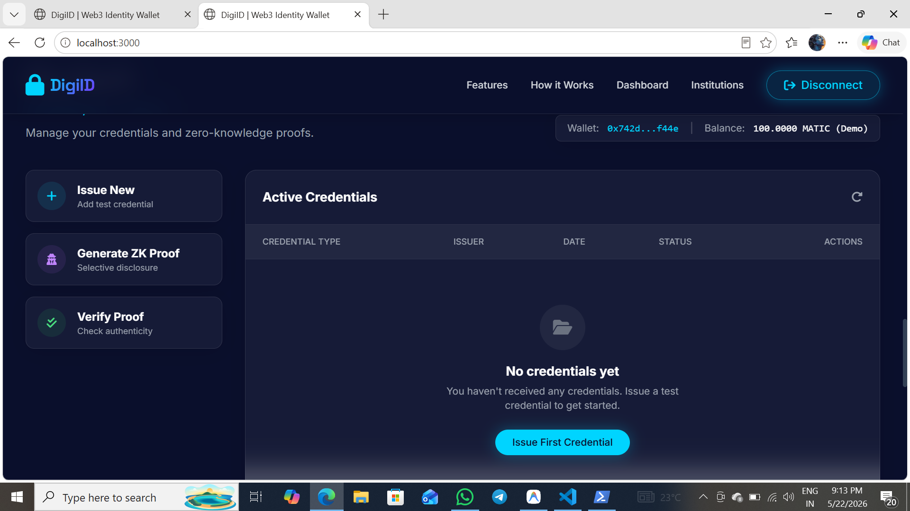

# 🔐 Unified Web3 Digital Identity Wallet

A decentralized self-sovereign identity wallet implementing 
W3C-compliant DIDs and Verifiable Credentials.

## 🖼️ Screenshots






















## 🛠️ Tech Stack
- Solidity + OpenZeppelin
- Node.js + Express.js
- MongoDB + Mongoose
- Ethers.js v6 + MetaMask
- Tailwind CSS + Anime.js + Particles.js
- JWT Authentication

## ✨ Features
- DID Registration On-Chain
- Verifiable Credentials Issuance
- MetaMask Wallet Integration
- QR Code Verification
- Offline Demo Mode Fallback
- Glassmorphic Futuristic UI

## ⚙️ How to Run Locally
```bash
cd identity-wallet
npm install
node server.js
Open http://localhost:3000
🚧 Status
Functional Prototype — Deployment in Progress
